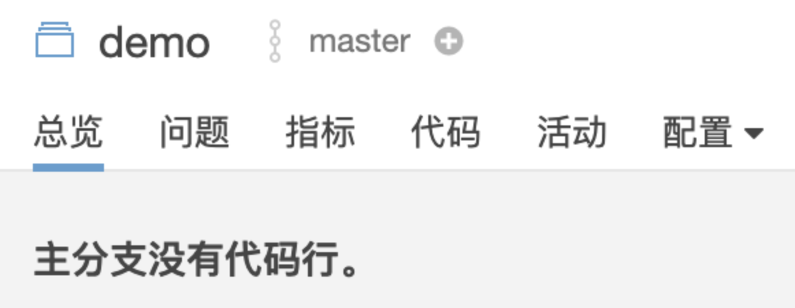

首先，向项目推广者 @CarlJi 和项目的所有contributors致敬。

### 背景
之前go代码的覆盖率收集一直是参考[有赞](https://tech.youzan.com/you-zan-go-xiang-mu-dan-ce-ji-cheng-zeng-liang-fu-gai-lu-tong-ji-yu-fen-xi/)的做法，缺点是不能很好的放到集群使用，只能在本地进行覆盖率，虽然也刚好契合了公司的测试模式，但始终效率有限也不够友好，后来发现了[goc](https://github.com/qiniu/goc)这个项目，简单方便，而且可以很好的在集群使用，只是收集覆盖率还是需要去pod执行，因此考虑把相关操作用shell脚本编写，然后打成镜像放到同一集群环境进行覆盖率采集

### 实现思路

说干就干，我们先使用[simple-go-server](https://github.com/CarlJi/simple-go-server)在本地做实验，把待测服务和goc server启动好

先看一下goc获取覆盖率的相关命令
```
goc profile --center=url:port > coverage.out 
```
这里需要指定goc server的地址和需要获取覆盖率的服务注册端口，也就是127.0.0.1:49748，把它们抽取为变量

```
#!/bin/bash
export URL
export PROT

set -e

URL=${URL:-'http://127.0.0.1'}
PROT=${PROT:-'49748'}

goc profile --center=${URL}:${PROT} > coverage.out 
```

这样一个基本脚本就好了，但是执行一次肯定是不够的，继续优化一下，增加一下频率控制和执行开关

```
while true
do 
    if [ ${SWITCH} -eq 0 ];then
        GET_COVER
    else
        echo 'cover suspend'
    fi
    sleep ${FREQUENCY}
done

```
现在执行脚本，可以获取到out文件了，但是可以看到out文件不够直观，当然可以把out转为html，但是我想要的是一个能持续更新**具体**覆盖情况的效果

为了这个效果，考虑自己写一个简单的服务端（flask）和前端页面，获取到覆盖率后把html作为参数发送过来存好，然后前端定时请求接口

然后我在快写完的时候发现我可以直接用sonar啊！！！为什么要自己写

脚本继续加入sonar的执行命令

```
sonar-scanner \
    -Dsonar.projectKey=${NAME} \
    -Dsonar.sources=. \
    -Dsonar.go.coverage.reportPaths=coverage.out \
    -Dsonar.projectVersion=${NUM} \
    -Dsonar.host.url=${SONARURL} \
    -Dsonar.login=${TOKEN} \
> /dev/null
```
执行一下，发现sonar没获取到正确到结果




检查后发现是因为当前目录下没有相关代码，需要增加cd到正确目录的逻辑，没有代码的话直接clone一份到当前目录

 ```
if ! echo `pwd` | grep ${CODEDOCUMENT} > /dev/null;then
        if [ ! -d ${CODEDOCUMENT} ];then
            git clone ${CODEURL}
        fi
        cd `pwd`/${CODEDOCUMENT}
    fi
```

好，基本逻辑弄好了，但是后期在集群里使用的时候发现无法git clone到代码，需要在镜像里补上密钥，同时因为集群的一些配置，我无权限在运行过程中新增文件夹（也就是不能发现没有代码再clone，而是一开始就需要clone好代码）

当然我可以先把待测代码clone到本地，然后和这个shell脚本一起打包后部署，但是感觉这样太麻烦

新思路是先配置一个带密钥的基础镜像，然后使用这个基础镜像定制新的镜像，需要clone的代码放到新镜像，定制的新镜像dockerfile如下

```
FROM cover_base:latest

COPY main.sh /tmp

COPY coverage.out /tmp

RUN git clone {demo} /tmp/{demo}

CMD [ "bash", "/tmp/main.sh"]
```

这样如果我需要新增一个服务在测试过程中的覆盖率获取，那就只需要新起一个分支，修改{demo}部署就好了

为了支持定制镜像的clone操作，现在把密钥打到基础镜像里(新生成了一个密钥)，顺便把goc、sonar-scanner也装进去，dockerfile如下

```
FROM centos:7

WORKDIR /app
 
RUN yum update -y && yum install -y git 

ARG SSH_PRIVATE_KEY

COPY sonar-scanner-4.0.0.1744-linux  /usr/lib/sonar-scanner 

RUN ln -s /usr/lib/sonar-scanner/bin/sonar-scanner /usr/local/bin/sonar-scanner

COPY goc /usr/local/bin/goc

ENV SONAR_RUNNER_HOME=/usr/lib/sonar-scanner

ENV GOC=/usr/lib/goc

RUN mkdir /root/.ssh && chmod 700 /root/.ssh

RUN ssh-keyscan cover > /root/.ssh/known_hosts

RUN echo "${SSH_PRIVATE_KEY}" > /root/.ssh/id_rsa

RUN chmod 600 /root/.ssh/*

CMD [ "echo", "hello"]

```

然后运行 

```
docker build -t {url}  --build-arg SSH_PRIVATE_KEY="$(cat ~/.ssh/cover)"
```

镜像就准备好了，之前的脚本因为不需要clone逻辑，也需要进行修改，同时因为打成镜像后方便调试，需要增加退出方法

最后脚本如下：

```
#!/bin/bash
export URL
export PROT
export NAME
export FREQUENCY
export CODEDOCUMENT
export CODEURL
export NUM
export TOKEN
export SWITCH
export SONARURL

set -e

URL=${URL:-'http://127.0.0.1'}
PROT=${PROT:-'0000'}
NAME=${NAME:-'demo'}
FREQUENCY=${FREQUENCY:-1}
CODEDOCUMENT=${CODEDOCUMENT:-'demo'}
NUM=${NUM:-0}
TOKEN=${TOKEN:-demo}
SWITCH=${SWITCH:-1}

if [ -n "${ENABLE_DEBUG}" ];then
    set -x
fi

function HANDLE_TERM()
{
        echo "exit test..."
        rm -rf coverage.out
        cd ..
        rm -rf ${CODEURL}
        exit 
}

trap 'HANDLE_TERM' SIGINT SIGTERM

function GET_COVER() {

    cd /tmp

    rest=$(goc profile --center=${URL}:${PROT})

    # 截取数据
    rest=$(echo "${rest/mode\: count /mode: set}")

    echo "$rest" > coverage.out 

    if [ $? -eq 0 ];then

        sonar-scanner \
            -Dsonar.projectKey=${NAME} \
            -Dsonar.sources=./${CODEDOCUMENT} \
            -Dsonar.go.coverage.reportPaths=coverage.out \
            -Dsonar.projectVersion=${NUM} \
            -Dsonar.host.url={sonar_url} \
            -Dsonar.login=${TOKEN} \
        > /dev/null
        NUM=$[${NUM}+1]
    else
        echo "$(date) sonar fail" > /dev/stderr
        exit 1
    fi
}

while true
do 
    if [ ${SWITCH} -eq 0 ];then
        GET_COVER
    else
       echo 'cover suspend'
    fi
    sleep ${FREQUENCY}
done
```

最后落地使用效果不错，能帮助补充用例缺失的部分

