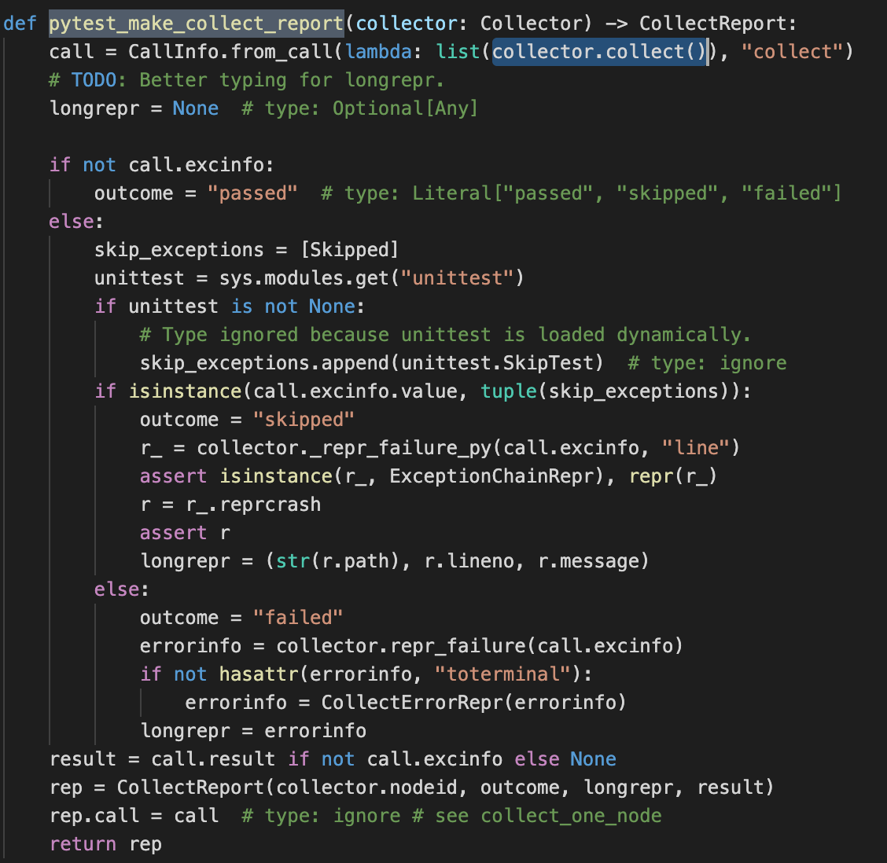
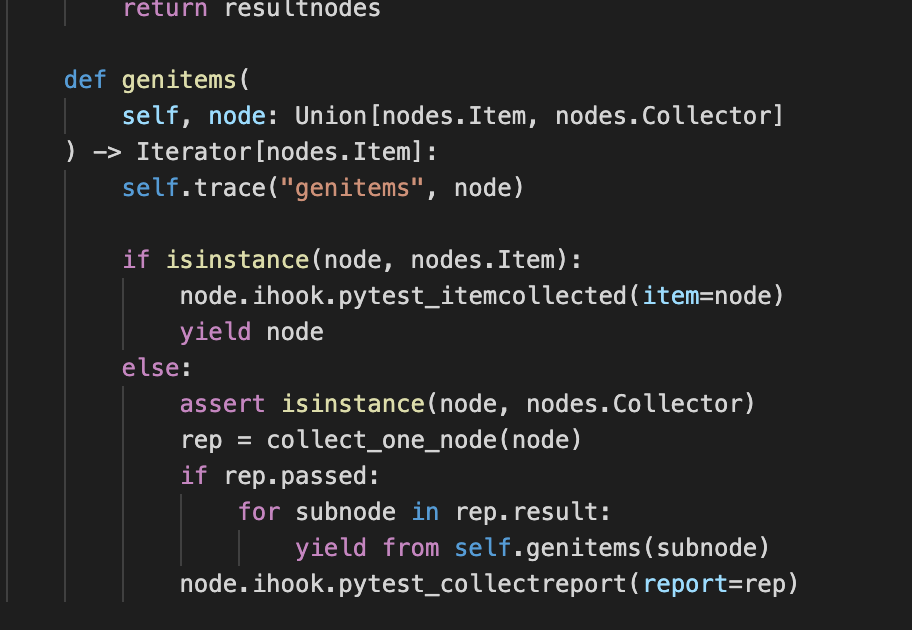

- [前言](#前言)
- [pytest执行过程](#执行过程)
  - [注册插件](#注册插件)
  - [收集用例](#收集用例)
  - [用例执行](#用例执行)
  - [报告采集](#报告采集)
- [自定义开发](#自定义开发)

# 前言

我们经常会使用pytest去编写测试代码，也会为了使用方便去安装一些pytest插件，但是在使用中我们是否有关注过pytest是怎么执行的呢？为什么它会有这么多插件(为什么开发它的插件这么方便)？

这里我简单分享一下pytest的基本执行逻辑和编写一个小插件的方法，帮助大家更好的理解pytest以及知道如何去扩展它

# pytest执行过程

我们首先要知道pytest的执行过程是怎样的，在执行pytest命令的时候它到底发生了什么

pytest执行流程分为4个步骤：插件注册->用例收集->用例执行->报告采集

而插件注册大体又分为：内置插件定义->内置插件注册->指定插件注册->conftest插件注册，这里的插件如果不好理解的话，可以视为执行步骤，就比如项目开发的步骤是：产品设计->开发->测试，这里的每一个步骤就是一个pytest的插件/hook函数

这里给出一下官方的说明


## 注册插件

直接看源码，当运行pytest.main()时，pytest首先去把传入的配置信息生成了一个config类，传入的插件信息生成PytestPluginManager类，然后进行内置插件的定义导入和注册和内置模块的导入


之后是注册用户提供的插件，插件的注册是LIFO原则，后进先执行


插件注册完成，把session状态修改为start，可以看到在这里就已经通过config.hook调用了刚才注册过的函数，而之后的全部执行都是在通过config.hook里注册的函数去完成，从注册插件到生成报告的整个过程就是通过原本定义好的插件（步骤）去执行，也就是我们是可以通过传入自定义的插件，去修改pytest执行的逻辑的


## 收集用例

插件注册后，就是要进行用例收集和执行了，我们可以通过_mian函数里的内容很清晰的知道，用例在这里通过config.hook.pytest_collection和config.hook.pytest_runtestloop两个方法去进行用例的收集和执行


说收集之前这里需要告知一个概念，在我们执行pytest的时候，是会默认生成一个Session类的实例的，这个session会有一个核心方法collect()，这个方法的作用是去收集到要执行的py文件，这些收集到的py文件里的数据，会成为一个Module类的实例，而这个Module也有一个核心方法collect()，这个方法会去收集到具体要执行的用例，使用这些用例的信息去生成Iiem类的实例

先看对py文件的收集，可以通过源码看到这个方法最后已经返回了item实例了，item是执行了genitems方法的获取到，这个方法需要传入rep这个参数，也就是这里的rep应该就是一个Module实例，那我们从collect_one_node()这个方法找下去


最后发现发现传入的Session实例是执行了它的collect()方法，通过这个方法获取到了py文件的内容



继续看session的collect的内容，它调用了_collect，而_collect中有一个看上去就像是在进行文件解析和收集的函数_collectfile，这个函数是继承自FSCollector类的，这个继承自FSCollector的方法，其实就是返回了pytest_collect_file()的收集结果


好，那现在我们文件已经收集了，接下来就是看一下获取用例的genitems方法是做了什么



这里我们发现有一个判断在，第一次我们传入的类的类型不是nodes.Item，因此collect_one_node方法又执行了一次，上面已经看到了在collect_one_node执行的过程中，有一个步骤是需要执行类的collect函数的，这里nodes.Module是使用了父类(PyCollector)collect方法，而这个方法最后执行了pytest_pycollect_makeitem去返回了一个item类，最后通过yield向上返回（这里的pytest_itemcollected()方法，是只有定义没有实现的）


## 用例执行

执行就相对简单了，这里直接上代码


可以看到就是执行了item的runtest方法

## 报告采集

这个部分实际上在用例执行的过程中，报告就同步采集了，包括前面的收集等步骤的过程都是有进行报告的采集的，所以这里不细说，因为这个过程比较难拆出来单独讲，采集后的报告最后通过pytest_terminal_summary方法输出


以上就是基本的pytest运行的流程

# 自定义开发

现在在知道了pytest的执行逻辑后，我们要如何制作自己的pytest插件或者搞点更多的东西呢

## 制作插件

通过上面的描述可以知道，其实pytest就是在按照定义好的hook执行，然后因为插件的注册顺序，我们提供的插件会先执行，那其实做一个插件的方法就是去重新实现一个hook函数，然后让pytest加载进去，至于有多少可以使用的hook函数，不同hook函数的执行顺序是怎样的，可以去查看官方文档

https://www.osgeo.cn/pytest/reference.html?highlight=pytest_runtest_logreport#hooks

这里用一个hook举例怎么用，比如我们目前想实现一个功能，作用是及时打出错误信息，而不是运行完成后统一打出，类似pytest-instafail，可以实现这个功能的hook很多，我用一个hook举例:

***pytest_runtest_logreport(report)***

我们可以看到这个hook有一个参数是report，因为实际上我们的函数就是运行在pytest里的，这里的入参我们是可以真正拿到，这个参数是一个TestReport类，类的结构如下：


运行过程中，如果用例失败，失败信息的会保存在report.longreprtext里，所以我们这里可以在执行结束后，直接去获取这个结果，同时我们只需要测例执行时的错误输出（setup，teardown不输出），那代码如下

/conftest.py

```python
def pytest_runtest_logreport(report):
	if report.when == 'call':
		print(report.longreprtext)
```

我们把这个函数放到conftest里，然后执行pytest就可以看到效果了，这其实就是一个小插件，如果不想把插件写在conftest里，可以自己起一个新的py文件

/plugin/myplugin.py

```python
class MyPlugin(object):

	def pytest_runtest_logreport(report):
      if report.when == 'call':
        print(report.longreprtext)
```

然后执行的时候这样去调用

```python
from plugin.myplugin import MyPlugin
pytest.main(file,plugins=[MyPlugin()])
```

## 制作自动化框架

这里通过一个官方例子说明，这是官方文档上给出的一个把用例用yaml组织并通过pytest调用的例子


很明确的可以看到，这里就是先通过pytest_collect_file返回了一个file的子类（Module类也是一个file的子类），然后这个类有一个collect方法，这个方法又返回了一个item子类，子类里带有runtest方法，整个实现逻辑就是上方说到了pytest的解析用例的逻辑

附加：

而如果我们现在要进行setup，teardown等操作的制定，这里也可通过pytest_runtest_setup或者给item子类新增一个setup等属性去做，但是，只建议用其中一个方法

为什么只建议用其中一个方法呢，是因为hook函数的注册是LIFO的原则，先进的函数还是会执行的，这里如果你定义了一个pytest_runtest_setup，又定义了一个self.setup（源码的pytest_runtest_setup里就是会执行一次item.setup()函数），实际上二者都是会执行一次的，为了避免执行内容冲突，因此只建议用一个方式去定义
