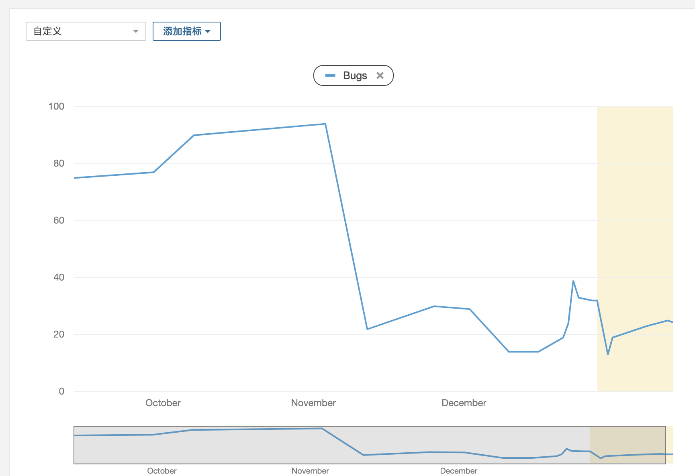
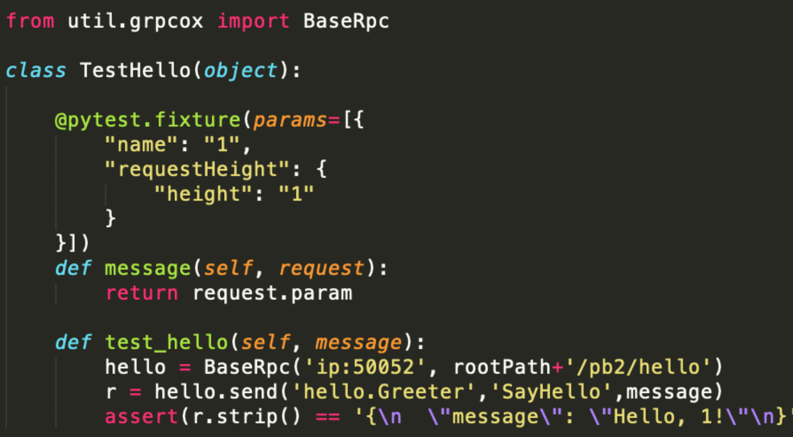
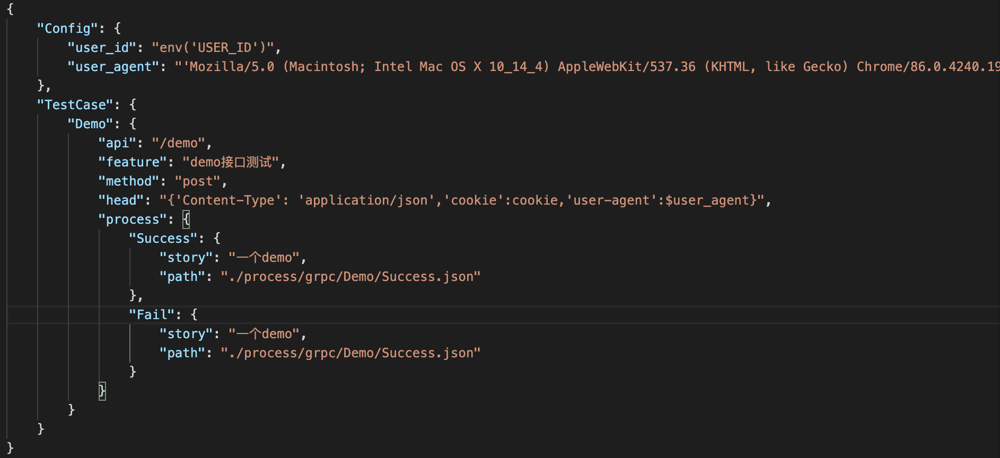
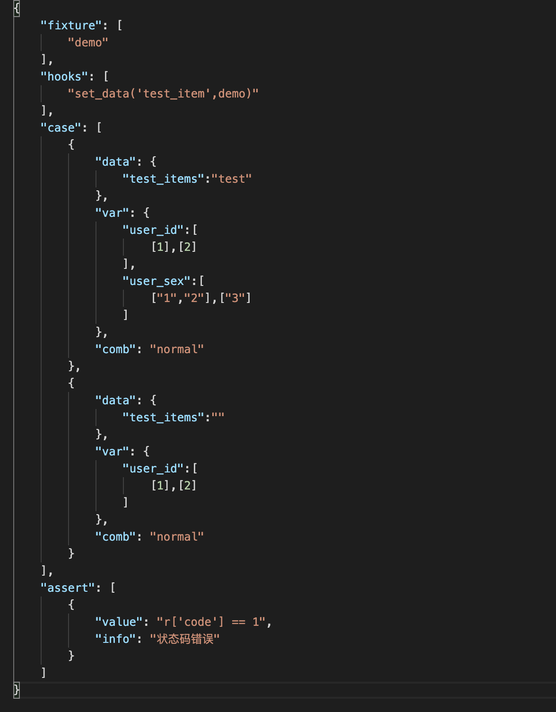
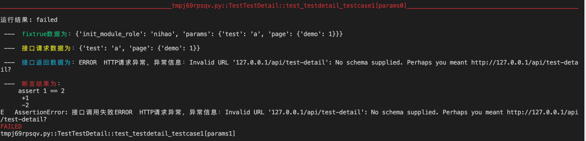
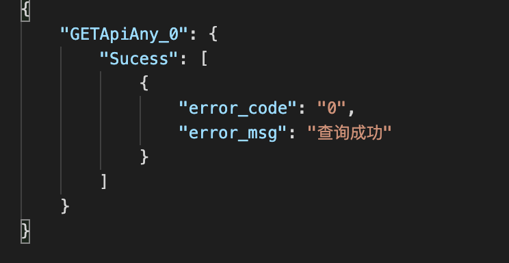
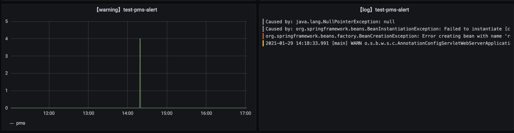

- [前言](#前言)
- [质量检查](#质量检查)
- [接口测试](#后端测试)
  - [grpc接口测试](#grpc接口测试)
  - [http接口测试](#http接口测试)
  - [业务流程测试](#业务流程测试)
- [持续集成](#持续集成)
- [面板监控](#面板监控)

# 前言

加入新项目后一段时间了，也逐步把后端部分各个节点都实现了自动化测试，这里沉淀一下过程中的方法和经验

首先我负责的这个是一个tob系统，提供内部使用的定位让我会更偏向后端的质量保证，也主要是从后端质量上入手，逐步搭建整个质量保证流程的，流程大致分为4个方面的内容

1. 开发的代码检查
2. 接口的自动化测试
3. 和当前ci流程的集成
4. 对线上异常的关注

以下逐个说明

# 质量检查

这个已经是一个老话题了，我刚加入这个公司的时候就有推行过sonar的代码扫描

那会还找后端同事也帮忙进行过推广，也逐步get到一些比如获取接口测试覆盖率这类的玩法，想试试看

但是很可惜，这个工具最后没能很好的使用，问题就一个：

***它用起来不够方便***

早期使用的时候sonar用的很不方便，配置麻烦，没有自动触发，分支数据也无法获取到，总之就一个样子多于里子的东西，对大家也没啥用

同时python，go，js都要去做规则筛选，多个原因交叉之下，最后这个工具就慢慢沉寂了

不过在后续思考如何把自动化测试集成到我们到ci流程中时，发现之前sonar难用的问题其实很简单就能处理

通过jenkins去做一个job，让它去拉代码，然后进行代码扫描，最后再去结果推到sonar服务器里，同时sonar配置都放job那边由测试去维护，然后一旦有代码提交就自动触发这个job

然后一开始也别急，从一个语言开始，不要一口吃成胖子，就比如我从java开始，先让大家培养出习惯，慢慢的筛选好规则，之后就可以把质量阀打开了

多分支的情况用sonar的一个插件去解析，拿到每一个分支的扫描结果

然后当项目发版上线的时候，sonar也同步更新项目的版本号，重新制定基准线，保证能获取到增量结果，看得到质量的逐步优化

可以看到每次扫描到到bug都在逐步降低，大家也开始接受这个工具

而且项目的sonar配置也已经流程化，只需要几分钟就可以配置好

# 接口测试

说完代码扫描，就到接口测试了

其实接口测试，到底是应该去测试什么呢？从个人的理解出发，广泛说有两个测试点：

1. 单接口完整测试
2. 业务流程接口测试

怎么算完整测试一个接口呢，或者说在这一步我们应该关注的接口用例应该是什么？

我的主要考虑的是，前端无法正常传递过来的数据、服务异常导致的数据、正常的场景的数据都需要考虑，甚至需要辅以覆盖率

因为很多的异常输入，在前端部分是有进行过检查的，正常使用系统的时候有些接口参数是不可能通过前端传递过来，也就是手工的点点点是无法测试这部分的

而有些服务之间互相依赖的时候，也会出现有服务异常导致的错误数据，这里也需要检查

同时还会重点关注一个方面，就是用例是独立的，不互相依赖的

比如说：如果a接口返回了一个id，而b接口必须要这个id作为参数，这个时候你怎么去编写b接口的用例

我看法是b接口应该抛弃对a的依赖，它需要的不是a给过来的参数，它需要的只是一个id，如果这个参数需要计算得到或者查库得到，那就去这么做，不要让接口在这个阶段的用例出现直接依赖，同时它的数据是独立的，独立生成，独立清除，单接口下的不同用例之间也不依赖同一个数据

这样的好处很明显，如果开发后面因为各种原因修改了b，那我只需要自动回归b，如果修改了a，那我也只需要回归a，接口之间是解耦的

第二个测试角度则是业务流程，这里的测试思路又和上面的测试完全相反了

接口的业务测试，用例之间应该是强依赖的，强耦合的，a失败了，b也要失败

一个业务场景：用户现在加了一个商品到购物车，然后页面刷新，用户点击付款

这个场景调用的接口大概是：新增购物车，购物车列表获取，支付和订单数据生成，订单结果获取这4个接口

但是第一个接口的入参，却是被后面的3个接口使用了，甚至加购物车之后，如果我们购物车列表没有获取到这个新商品，这个用例就失败了，就应该停止了，用例的操作步骤之间是强关联的，某个节点失败了，用例就已经完全失败了，所以业务层面的接口测试，用例之间必须强关联

同时对接口的校验也不是和单接口一样，单接口的时候我加购了一个商品，然后因为接口没有返回我具体的信息，我不确定数据是否落库，那我需要去查询数据库确定，而业务接口测试的时候，对商品是否成功新增，是需要通过另一个接口的返回值去确定的（获取购物车列表）

同时业务流程的测试也是在压测的时候常用的测试方法（压测场景），在运行业务流程接口用例时候，也确实发现了平时手工测试和单接口测试时候没有发现的问题（因为有时速度快会导致压力相对较高）

这个就是业务接口测试（集成）和单接口（单元）的差别
  - 单接口测试：接口之间需要解耦，会使用sql或者编写代码配合进行接口功能的验证
  - 业务接口测试：只需要初始数据的准备和最后的数据清理，接口之间是强耦合的，能通过接口之间互相验证的功能

因为这个项目是一个同时有grpc，http两种接口的项目，现在测试思路确定了，那这两种接口我又是如何去测试的呢

### grpc接口测试

去年下半年这样公司开始推行grpc，测试为了能进行grpc的测试也找到了一些工具

但是有一个问题其实是没有很好解决的，那就是更方便的用例持久化和自动回归，为此我封装了grpcox的接口，提供一个更方便的方法去进行grpc测试，[grpc_tool](https://github.com/mokulai/grpc_tool)，使用方法如下

这样可以使用代码去编写grpc测试用例，我也顺便把它和自己写的一个小工具结合在一起了

grpc接口描述和用例描述：

具体用例相关配置：

配置中的fixture，hook 是通过指定自定义的方法去进行接口解耦，这里会需要配置一些sql，或者造数据的工具

通过使用自己开发的这个工具，可以使用json文件去发起grpc测试，并自己新增了优化测试报告的插件

因为是使用json进行文件描述的，之后如果需要集成到测试平台，也可以很方便的进行保存和使用

### http接口测试

grpc测试之后就是要考虑如何进行http测试了，http测试的方法真的很多，从swagger到postman工具都是用不完的

不过这里我也是使用了自己的命令行工具去做http测试，和grpc测试的json配置类似，http的配置方式和grpc没有太大差异

### 业务流程接口测试

上面说完了我对单接口测试的落地，那现在到业务流程接口的测试落地

当然也可以叫做自动化生成接口测试代码，比较典型的工具就是httprunner自带的har2case，它可以把har文件转为符合自己框架格式的yaml文件

不过我出于业务考虑会有一些需求，比如过滤特定接口，过滤特定字段等，过滤第x次出现的某接口等，同时再回放的时候也想直接进行diff，不想花太多时间去修改录制的文件

后续考虑过流量录制，那会和ShaoNianyr出了一些方案，如：
- [如何让线上录制回放落地的具体思路](https://testerhome.com/topics/25693)

但是因为一些技术问题，最后没能落地，不过也还是有些思路上的收获

最后落地呢，是通过mitmproxy开发了一个小工具，我也把它集成到命令行工具里了，作用是可以直接通过抓包的方式获取到指定路由的接口请求和返回，并且可以通过配置过滤规则保存需要的数据

录制后的文件分为：接口请求文件，接口返回文件两个

然后在请求文件部分，清理掉无测试意义的接口，同时对有意义的接口进行一些注释，提取出后续接口要用的数据等

拿我做的这个项目的举例，一个差不多要连续调用43个接口的业务流程，从录制到完成自动化配置，一共只是半小时不到，比起手写时间成本大大降低

同时如果需要的话还可以前端同步录制前端的测试代码，前后端一波搞完，甚至可以在手工测试完成后，快速完成之后的回归脚本

自此整个接口测试的自动化用例都完成了，之后可以直接在测试环境跑一遍获取一下用例覆盖率看看，再根据情况进行补充

# 持续集成

接口的自动化用例都已经编写完成了，但如果不能实现自动回归的话，其实价值是大打折扣的

在有自动化用例的前提下，要实现持续回归，就是缺了一个调度器

为了快速落地，我使用的是jenkins作为调度器，这样成本最低

在相关job里配置了一个钉钉机器人，当回归失败的时候通过钉钉通知

配置到开发的ci流程里进行自动回归，同时获取到的allure测试报告也很好看

# 面板监控

搞完了自动化用例和持续回归后，下一步就是进行监控了，因为不是对外的系统，监控的重心更多在报错监控而不是性能监控，同时报错监控也可以帮忙发现一些测试过程中不易发现的错误

因为运维配置了loki，配合用grafana配置一个错误日志的监控面板还挺简单的

# 总结

零零散散的也算搞完了从git push -> sonar -> grpc 回归 -> http 回归 -> 业务用例回归 -> 线上监控 -> 钉钉报警整个流程，相关步骤的配置方式也在自己的组内完成了分享，希望之后可以想到更多更好的方式去继续保证项目的质量

