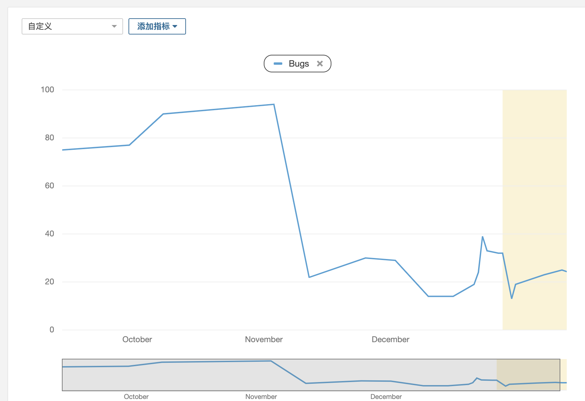
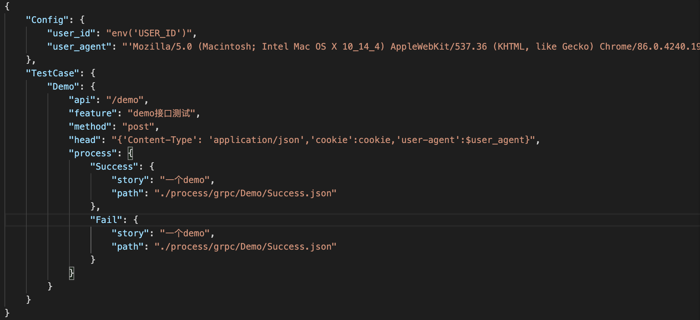
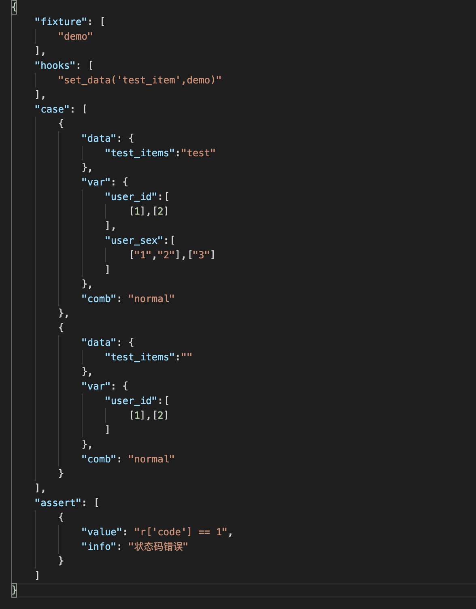
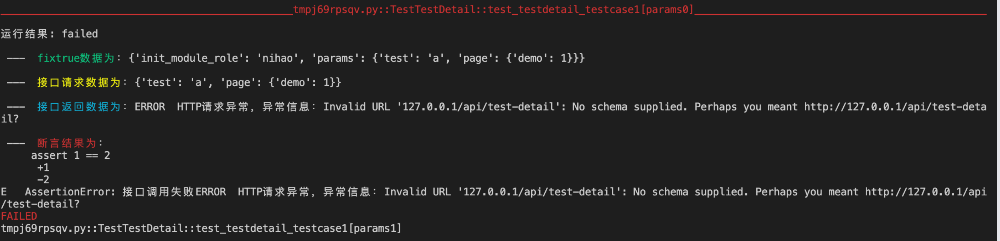
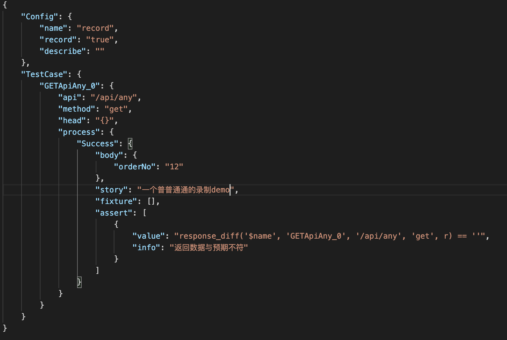
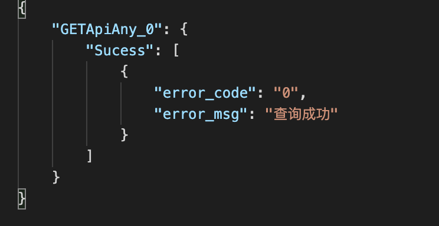
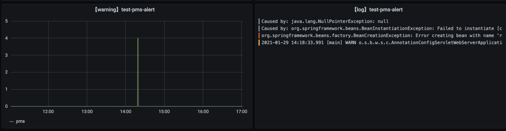

- [前言](#前言)
- [质量检查](#质量检查)
- [接口测试](#后端测试)
  - [grpc接口测试](#grpc接口测试)
  - [http接口测试](#http接口测试)
  - [业务流程测试](#业务流程测试)
- [持续集成](#持续集成)
- [面板监控](#面板监控)

# 前言

加入新项目后差不多3个月时间左右，也逐步把后端部分各个节点都实现了自动化测试，这里沉淀一下过程中的方法和经验

首先我负责的这个是一个tob系统，提供内部使用的定位让我会更偏向后端的质量保证，也主要是从后端质量上入手，逐步搭建整个质量保证流程的，流程大致分为4个方面的内容

1. 开发的代码检查
2. 接口的自动化测试
3. 和当前ci流程的集成
4. 对线上异常的关注

以下我逐个说明

# 质量检查

这个已经是一个老话题了，我刚加入这个公司的时候就有推行过sonar的代码扫描

那会还找后端同事也帮忙进行过推广，也逐步get到一些比如获取接口测试覆盖率这类的玩法

但是很可惜，这个工具最后没能很好的使用，问题就一个：

***它很不方便***

对，早期使用sonar是真的很不方便，配置麻烦，又不能自动触发，分支数据也无法获取到，总之就一个样子多于里子的东西，对大家也没啥用

同时python，go，js都要去做规则筛选，多个原因交叉之下，最后这个工具就慢慢沉寂了

不过还好没放弃，在后续思考如何把自动化测试集成到我们到ci流程中时，发现之前sonar难用的问题其实很简单就能处理

我们通过jenkins去做一个job，让它去拉代码，然后进行代码扫描，最后再去结果推到sonar服务器里，同时sonar配置都放job那边由测试去维护，然后一旦有代码提交就自动触发这个job

然后一开始也别急，从一个语言开始，不要一口吃成胖子，就比如我从java开始，先让大家培养出习惯，慢慢的筛选好规则，之后就可以把质量阀打开了

多分支的情况用sonar的一个插件去解析，拿到每一个分支的扫描结果

然后当项目发版上线的时候，sonar也同步更新项目的版本号，重新制定基准线，保证能获取到增量结果，看得到质量的逐步优化

可以看到每次扫描到到bug都在逐步降低

而且项目的sonar配置也已经流程化，只需要几分钟就可以配置好

# 接口测试

说完代码扫描，就到接口测试了

其实接口测试，我们到底是应该去测试什么呢？从个人的理解出发，广泛说有两个测试点：

1. 单接口健全性测试
2. 业务流程接口测试

什么是接口的健全性，或者说在这一步我们应该关注的接口用例应该是什么？

我的答案是，前端无法正常传递过来的数据

因为很多的异常输入，在前端部分是有进行过检查的，正常使用系统的时候有些接口参数是不可能通过前端传递过来，也就是手工的点点点是无法测试这部分的，而这部分测试，就是对接口的健全性测试

同时还会关注另一个方面，就是用例是独立的，不互相依赖的

我这里举一个例子：如果a接口返回了一个id，而b接口必须要这个id作为参数，这个时候你怎么去编写b接口的用例

是不是第一反应就是让ab接口进行关联，先测a，然后取需要的值给b

但是在我看来，如果用例是这么设计的，那这个用例是不够解耦的，b接口应该抛弃对a的依赖，它需要的不是a给过来的参数，只是一个很普通的参数，如果这个参数需要计算得到或者查库得到，那就去这么做，在这一步不要让接口直接的用例出现依赖

这样的好处很明显，如果开发后面因为各种原因修改了b，那我只需要自动回归b，如果修改了a，那我也只需要回归a，接口之间是解耦的

第二个测试角度则是业务流程，这里的测试思路又和上面的测试完全相反了

接口的业务测试，用例之间应该是强依赖的，强耦合的，a失败了，b也要失败

一个真正的业务场景：用户现在加了一个商品到购物车，然后页面刷新，用户点击付款

这个一个很常见的业务场景，也是我们平常做的最多的手工测试，这个场景它调用了多少接口呢

核心部分当然是：新增购物车，购物车列表获取，支付和订单数据生成，订单结果获取这4个接口，

但是第一个接口的值，却是被后面的3个接口使用了，甚至加购物车之后，如果我们购物车列表没有获取到这个新商品，这个用例就失败了，就应该停止了，用例的操作步骤之间是强关联的，某个节点失败了，用例就已经完全失败了，所以业务层面到接口测试，用例之间必须强关联

同时业务测试下对接口的校验也不是和单接口一样，单接口的时候我新增了一个商品，然后因为接口没有返回我具体的信息，我不确定数据是否落库，那我需要去查询数据库确定，而业务接口测试的时候，对商品是否成功新增，是需要通过另一个接口的返回值去确定的

同时业务流程的测试也是在压测的时候常用的测试方法（压测场景），在运行业务流程接口用例时候，也确实发现了平时手工测试和单接口测试时候没有发现的问题（因为压力相对较高）

这个就是业务接口测试（集成）和单接口（单元）的差别
  - 单接口测试：接口之间需要解耦，会有大量的sql或者代码配合进行接口功能的验证，
  - 业务接口测试：只需要初始数据的准备和最后的数据清理，接口之间是强耦合的，能通过接口之件互相验证的功能就不应该通过代码或者查库的方式去进行

因为这个项目是一个同时有grpc，http两种接口的项目，现在测试思路确定了，那这两种接口我又是如何去测试的呢

### grpc接口测试

去年下半年这样公司开始推行grpc，测试为了能进行grpc的测试也找到了一些工具

但是有一个问题其实是没有很好解决的，那就是更方便的用例持久化和自动回归，为此我封装了grpcox的接口，提供一个更方便的方法去进行grpc测试，[grpc_tool](https://github.com/mokulai/grpc_tool)

这样虽然可以正常使用了，也可以使用代码去编写grpc测试，不过又有一个问题出现了，如果我不会代码呢？或者，如果我之后需要一个测试平台呢？我要直接放代码上去吗？

为此开始尝试去使用json描述grpc接口

grpc接口描述和用例描述：

具体用例相关配置：

配置中的fixture，hook 是通过指定自定义的方法去进行接口解耦，这里会需要配置一些sql，或者造数据的工具

通过使用自己开发的命令行工具mat，可以使用json文件去发起grpc测试，并自己新增了优化测试报告的插件

因为是使用json进行文件描述的，之后如果需要集成到测试平台，也可以很方便的进行保存和使用

### http接口测试

grpc测试之后就是要考虑如何进行http测试了，http测试的方法真的很多，从swagger到postman工具都是用不完的

不过这里我也是使用了自己的命令行工具去做http测试，和grpc测试的json配置类似，http的配置方式和grpc没有太大差异

### 业务流程接口测试

上面说完了我对单接口测试的落地，那现在到业务流程接口的测试落地

其实这个业务流程接口测试在行业内也叫做自动化接口测试代码生成，比较典型的工具就是httprunner自带的har2case，它可以把har文件转为符合自己框架格式的yaml文件

不过这个工具的问题在于，不能进行自定义的接口过滤，也不会带有接口的返回数据，断言只自带一个状态码200的断言，这个用不了啊

后续又考虑过流量录制，那会和ShaoNianyr还出了一些方案，如：
- [如何让线上录制回放落地的具体思路](./如何让线上录制回放落地的具体思路.md)

但是因为一些技术问题，最后没能落地，不过也还是有些思路上的收获

最后落地呢，是通过mitmproxy开发了一个小工具，我也把它集成到mat命令行工具里了，作用是可以直接通过抓包的方式获取到指定路由的接口请求和返回，并且可以通过配置过滤规则保存需要的数据

录制后的文件分为：接口请求文件，接口返回文件两个

然后在请求文件部分，清理掉无测试意义的接口，同时对有意义的接口进行步骤描述，提取出后续接口要用的数据，并替换那些继承自前接口的参数

拿这个项目的用例举例，一个43个接口的自动化业务流程，从录制到完成用例配置，一共只是半小时，比起手写时间成本大大降低

# 持续集成

接口的自动化用例都已经编写完成了，如果不能实现自动回归的话，其实落地价值是大打折扣的

在有自动化用例的前提下，要实现持续回归，那我们缺失的东西就是一个测试调度器

我使用的是jenkins作为测试调度器，这样的成本是最低的

并且在job里还配置了一个钉钉机器人，当回归失败的时候会通过钉钉通知

通过这个报警机制，成功多次抓到开发合并master后没通知测试的情况，同时也提前在进入测试前发现了一些问题，最重要的是allure的测试报告很好看

# 面板监控

搞完了自动化用例和持续集成后，下一步就是进行监控了，因为pms不是对外的系统，监控的重心更多在报错监控而不是性能监控，同时报错监控也可以帮忙发现一些测试过程中不易发现的错误

因为有了loki这个工具，配置一个错误日志的监控面板还挺简单的

# 总结

以上就是这几个月来的后端探索，针对项目上下一步的话考虑java的测试覆盖率获取（go的goc已经落地）

对测试组内的话考虑工具推广，应该会往平台化走（不是谁都和我一样喜欢写很长的json的）也当作是自己go语言的练习吧