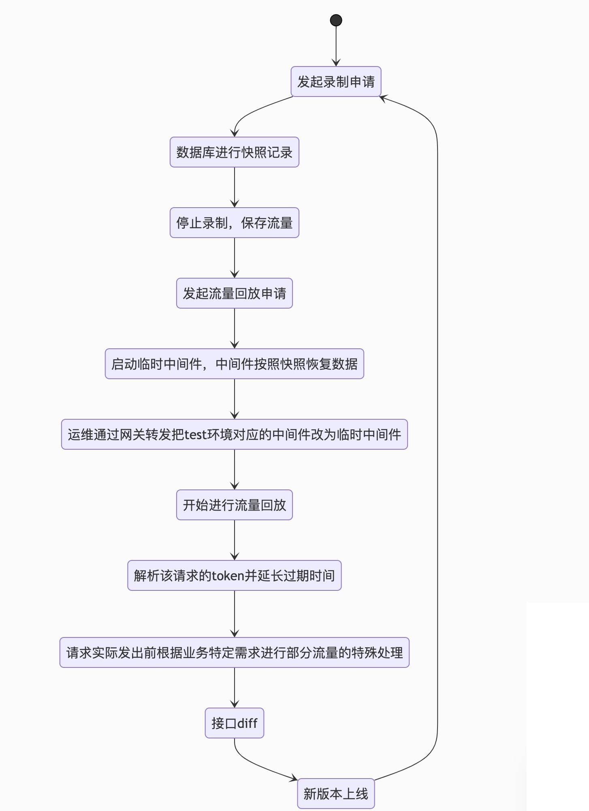

## 背景

这几天看到朋友提出了一个思路，就是对项目[进行流量录制和回放](https://testerhome.com/topics/25641)
通过录制+回放的方式，在每次测试新功能的时候就可以只关心如何测好新的接口和如何回归无法录制的接口，甚至可以减少大部分功能的自动化测试代码
不过在当前的讨论中，发现实际操作的时候，本质上没有和寻常的接口测试/压测有太多区别，且落地上会存在一些问题

## 落地的难点

1. 如果只是录制+回放，那么接口的对错是不能判断的，所以需要引入diff，然后如果要加入diff的话，有一个问题是无法避开的，如何保证线上的数据能在线下使用？
2. 录制的时候如果遇到了修改数据库操作的请求，怎么处理？
3. 录制应该有时限，我们是否应该按照版本进行录制？如果按照版本进行，那如何处理老的流量？

## 我们的解决思路

首先思考到的方式是：

1. 把diff的目的改为：找到返回一致的接口，把线上的请求带的参数通过文中例子说的规则匹配转换为可以在线下用的参数，对比没有出问题的接口

2. 在代码层面增加一个fake中间件的逻辑，如果我们是在进行流量回放（比如通过header带一个参数做判断），那么连接的就是一个假的中间件，这里以mysql举例，这个中间件的作用是把录制时间段内的sql操作，sql的返回结果进行记录，并一一对应hash处理，当这个服务被其他服务调用且传过来了sql，就返回线上数据库里这个sql的查询结果。这样的好处是把最顶层（流量），最底层（中间件返回的结果）都进行了一次录制，相同的请求，相同的中间件查询，这样不同环境下接口的回归和diff如果出现了问题，那就说明这个接口发生了变化，达到了我们进行diff的目的，简单说，就是中间件的mock

## 再次遇到了问题

对于第一个方案，如果线上线下数据差异过大，把http请求带的在test环境找不到的参数都转为一个，或者一部分特定值，那么这个接口的返回和线上接口的返回不一致的可能就是很大的，如果流量很多，我们没触发diff的接口就会远远少于触发diff的接口，如果这个时候去把那些触发diff的结果都看一遍，那会是一个工作量特别大的事情

对于第二个方案，等于我们需要去根据中间件的接口重写一份我们的fake接口，同时也会修改到业务代码，时间成本是巨大的，同时测试团队目前也没有这个技术资源

## 新的思路

那我们能不能找到一个不需要改业务代码，能用到线上流量的方案呢？

有的，就是有点粗暴

流程如下（仅只回归测试，新功能测试还是需要自己来哈）

这个过程中的diff也不是传统的diff，没有进行2次请求自动降噪，而是直接对比，噪音数据人工配置规则进行过滤（这个是根据当前我们的业务来的，接口中不存在太多噪音，也有考虑再多一个环境的成本问题）

## 是不是漏了一个东西？

上面一直没有提到老版本流量的处理

针对老的流量，可以在test环境进行回放时，去获取到当前流量的覆盖率（goc/jacoco+sonar），和上一个版本的覆盖率情况做对比，找到覆盖率有差异的数据，人工分析整理到一个精华测例集里面（自动化代码或者流量文件形式都可以）

在去年MTSC大会上，平安证券也分享过如何对线上的流量数据进行分析和留存的思路（平安证券-基于生产日志的接口用例设计与优化）

## 补充

这里提了两个解决 回放流量时候 线上数据库 和 测试数据库 不一致差异问题 的方案:

1. fake 方案: 代码层实现 fakeDB 以及 fakeInterface ，对标记 fake 流量的相同 sql 查询，走 fakeDB，返回相同的 response，直接解决数据差异的问题。

        - 优点: 流量拿来就用，加上 fake 标记即可回放。

        - 缺点: 需要改代码，需要对不同中间件接口实现fake接口

2. test-prod 方案: 底层实现测试环境对接线上影子库，用线上流量日志回放 stage 以及 test-prod

        - 优点: 不用改业务代码。

        - 缺点: 需要实现快照恢复和一键切换到影子库。

    test-prod 方案实施仍需解决的问题:

        - 快照数据库好解决，中间件数据的缓存如何快照恢复?

        - 涉及存储的业务，在回放前，需要获取线上存储的快照数据，并同步到测试存储环境中。

        - 需要统一日志格式，按日志格式实现一个请求模拟服务器，并实现转发前后业务逻辑替换规则。

目前只打算从仅和mysql相关的业务进行推动，落地之后逐步解决问题（有资源后会考虑去实现第一个的fake方案）